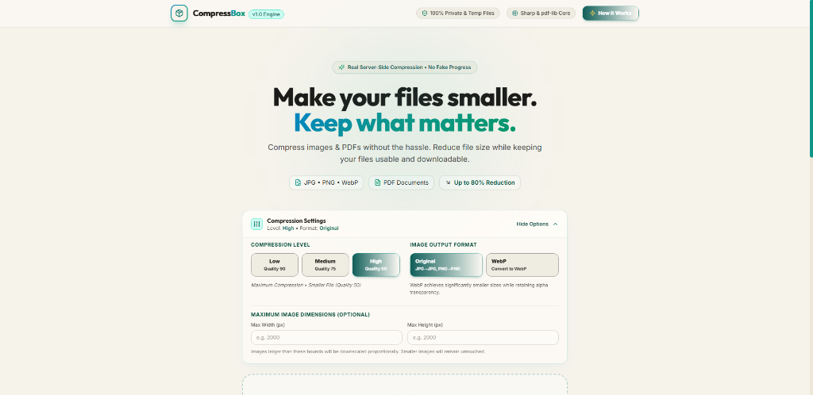
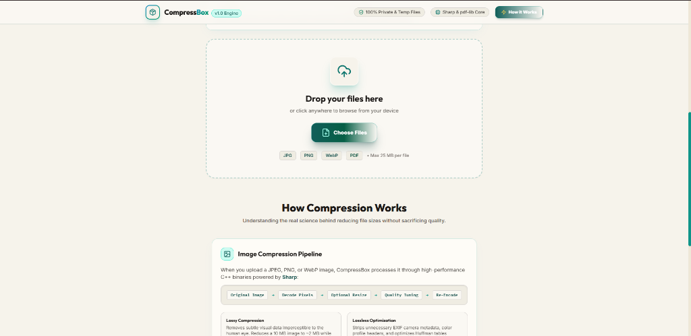
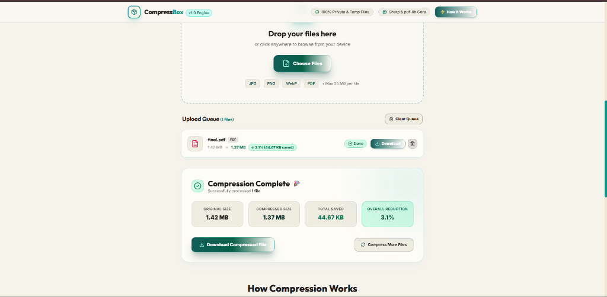
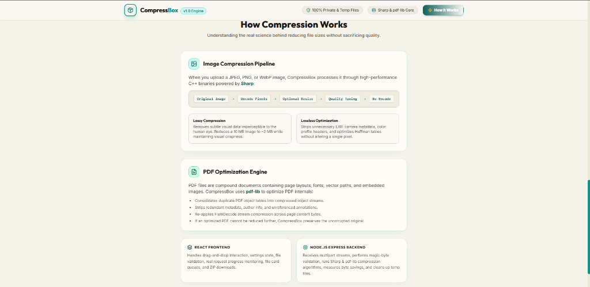

# 📦 CompressBox — Real Image & PDF File Compressor

> **"Make your files smaller. Keep what matters."**

**CompressBox** is a complete, production-quality full-stack web application designed for **real file size reduction** of images (JPG, JPEG, PNG, WebP) and PDF documents.

Unlike simple archiving utilities that wrap original files in a ZIP container, CompressBox executes **real server-side binary compression algorithms**, measuring precise byte savings and providing instant, high-quality downloads.

---

## 📷 Project Interface & Input-Output Screenshots

### 1. Main Header, Hero Banner & Compression Settings

*Figure 1: Header navigation, hero introduction, and customizable compression level & output format controls.*

### 2. Drag & Drop Upload Zone & Queue Input

*Figure 2: Drag-and-drop file upload zone supporting JPG, PNG, WebP & PDF files with real-time queue status.*

### 3. Compression Results Dashboard & Output Savings Metrics

*Figure 3: Detailed output results panel showing original vs compressed file sizes, byte savings, percentage reduction, and single/ZIP download triggers.*

### 4. Technical Architecture & How Compression Works

*Figure 4: Educational overview explaining Sharp image pipeline, pdf-lib structural stream optimization, and system responsibilities.*

---

## 🌟 Key Features

- 🖼️ **Real Image Compression**: Server-side processing powered by [Sharp](https://sharp.pixelplumbing.com/) (supports JPG, JPEG, PNG, WebP).
- 📄 **Real PDF Optimization**: Structural stream and object table compression powered by [pdf-lib](https://pdf-lib.js.org/).
- 🎛️ **Configurable Settings**: Choose compression level (Low: 90% quality, Medium: 75% quality, High: 50% quality), optional maximum width/height bounds, and output format (Original vs WebP).
- 🛡️ **PNG Transparency & WebP Handling**: Preserves alpha transparency across PNG and WebP conversions.
- 📊 **Real Byte Savings & Metrics**: Precise side-by-side comparison (`Original Size`, `Compressed Size`, `Saved Bytes`, `Percentage Reduction`).
- 📁 **Queue & Multiple File Processing**: Process up to 20 files per batch (max 25 MB per file, 100 MB total).
- 📦 **Download All (ZIP)**: Download all processed files in a single bundled ZIP archive (*ZIP bundling happens AFTER real individual compression*).
- 🔒 **Zero Persistent DB & Security Hardened**: Magic-byte MIME detection, sanitized filenames, path traversal protection, and automatic temporary file cleanup.

---

## 📚 Compression Logic & Architecture

### 1. How Image Compression Works

Images are decoded into raw pixel buffers and re-encoded using optimized parameters:

```text
Original Image
      ↓
Read Image Metadata
      ↓
Decode Pixels
      ↓
Optional Resize (Max Width/Height)
      ↓
Reduce Quality / Optimize Encoding Tables
      ↓
Encode Again
      ↓
Compressed Image
```

#### Lossy Compression
Visual data imperceptible to the human eye is removed to achieve major size reductions (e.g., a 10.2 MB photo compressed to 2.4 MB with quality = 75).

#### Lossless Optimization
Strips unnecessary camera EXIF headers, metadata, and color profile dictionaries while leaving all visual pixels 100% untouched.

---

### 2. How PDF Compression Works

PDF documents are compound objects containing page structural trees, streams, fonts, and embedded graphics:

1. **Object Stream Compression**: Combines indirect PDF structural objects into compressed object streams.
2. **Metadata Stripping**: Cleans unreferenced author/producer metadata streams upon medium or high compression.
3. **FlateDecode Re-compression**: Re-applies zlib stream compression to page layout streams.
4. **Safety Preservation**: If an optimized PDF is already fully compressed and cannot be reduced further, CompressBox preserves the original uncorrupted file and communicates this clearly to the user.

---

### 3. Frontend vs Backend Responsibilities

```text
React (Client)
      ↓  (HTTP Multipart Upload)
Express + Multer (Server)
      ↓
File Validation & Magic-Byte Detection
      ↓
Compression Engine (Sharp for Images / pdf-lib for PDFs)
      ↓
Calculate Byte Savings (Original vs Compressed)
      ↓
Return Metadata & Serve Downloads
```

#### What React Does:
- Manages drag-and-drop file state and settings controls.
- Enforces instant client-side file size and extension pre-validation.
- Monitors live request lifecycle states (`Waiting`, `Uploading`, `Compressing`, `Completed`, `Failed`).
- Displays file queue cards, preview thumbnails, and result statistics.
- Handles single downloads and batch ZIP archive requests.

#### What Node.js Does:
- Receives multi-part file payloads using Multer.
- Conducts magic-byte file header validation.
- Routes images to Sharp and PDFs to pdf-lib.
- Enforces file size boundaries and sanitizes filenames.
- Manages temporary file lifecycle and runs periodic cleanup background workers.

#### Why Sharp?
Sharp is the fastest Node.js module for image processing, utilizing libvips C++ binaries for high-speed encoding without memory bloat.

#### Why ZIP?
ZIP is **NOT** the primary compression engine. It is used **exclusively** when the user requests "Download All" to bundle already-compressed files into a single download package.

---

## 🛠️ Project Structure

```text
compressor/
│
├── client/                      # React Frontend (Vite)
│   ├── src/
│   │   ├── components/
│   │   │   ├── Header.jsx       # Branding header & nav
│   │   │   ├── Hero.jsx         # Hero title & taglines
│   │   │   ├── UploadZone.jsx   # Drag & drop upload box
│   │   │   ├── CompressionSettings.jsx # Quality, format, dimensions
│   │   │   ├── FileList.jsx     # Queue manager
│   │   │   ├── FileCard.jsx     # File status, preview & metrics
│   │   │   ├── ResultsSummary.jsx # Dashboard & celebration banner
│   │   │   └── CompressionExplanation.jsx # Technical guide section
│   │   ├── services/
│   │   │   └── api.js           # REST API fetch client
│   │   ├── utils/
│   │   │   └── formatters.js    # File size formatting helper
│   │   ├── App.jsx              # Main state container
│   │   ├── index.css            # Tailwind & glassmorphic styles
│   │   └── main.jsx             # React DOM entry
│   ├── index.html
│   ├── tailwind.config.js
│   ├── vite.config.js
│   └── package.json
│
├── server/                      # Express Backend
│   ├── controllers/
│   │   └── compressionController.js # Core upload, compress & zip handler
│   ├── middleware/
│   │   ├── upload.js            # Multer file storage & limits
│   │   └── validation.js        # Magic byte & total size validation
│   ├── services/
│   │   ├── imageCompressor.js   # Sharp image compression engine
│   │   ├── pdfCompressor.js     # pdf-lib PDF optimization engine
│   │   └── zipService.js        # Archiver ZIP bundling service
│   ├── utils/
│   │   ├── cleanup.js           # Temp file registration & auto-deleter
│   │   └── fileUtils.js         # Magic byte checker & byte math
│   ├── uploads/                 # Temporary input uploads
│   ├── processed/               # Temporary compressed outputs
│   ├── routes/
│   │   └── compressionRoutes.js # REST API endpoints
│   ├── server.js                # Express app listener
│   └── package.json
│
├── .gitignore
└── README.md
```

---

## 🚀 Getting Started (Run Locally)

### Prerequisites

- [Node.js](https://nodejs.org/) (v18+ recommended)
- `npm` or `yarn`

### 1. Start Backend Server

```bash
cd server
npm install
npm run dev
```

The Express API engine will launch on `http://localhost:5000`.

### 2. Start Frontend Client

In a new terminal window:

```bash
cd client
npm install
npm run dev
```

The Vite React application will open on `http://localhost:5173`.

---

## 🔒 Security & Privacy Features

- **No Permanent Storage**: All files are stored temporarily in `/server/uploads` and `/server/processed`.
- **Automatic Cleanup**: Files are automatically purged 30 minutes after upload or upon server shutdown.
- **Magic-Byte Header Checking**: File types are validated using initial file header bytes rather than trusting filename extensions alone.
- **Sanitized Filenames**: Protects against path traversal attacks (`../`) and shell script execution attempts.

---

## 📄 License

Distributed under the ISC License. Free for educational and personal use.
